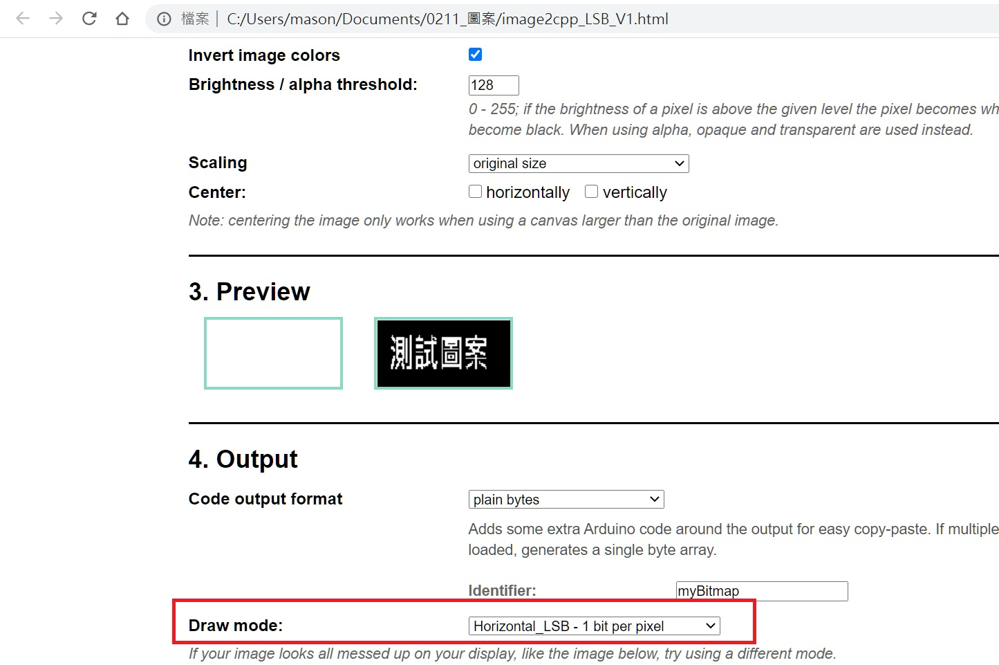
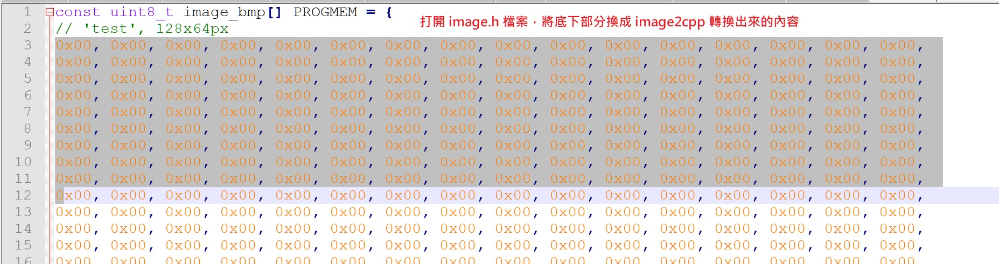

# Image2cpp (Add LSB first function by Mason)

Forked from javl.github.io/image2cpp/ 

工具網址 https://masonchen1003.github.io/image2cpp/index.html

原先 tool 不支援 LSB first 功能，造成使用 SSD1306 顯示時會有問題

- 勾選 Invert image colors，讓顯示為黑底白字
- Draw mode:	
選擇第一個  Horizontal_LSB - 1 bit per pixel

- 產生的 code 就可以讓 ESP32CAM 來使用

# 使用介面

# 圖案可先用小畫家準備 128x64 的 bmp file 

# 使用附件中的 ino file時，需將 image.h 內容換成 image2cpp 轉出來的 code

