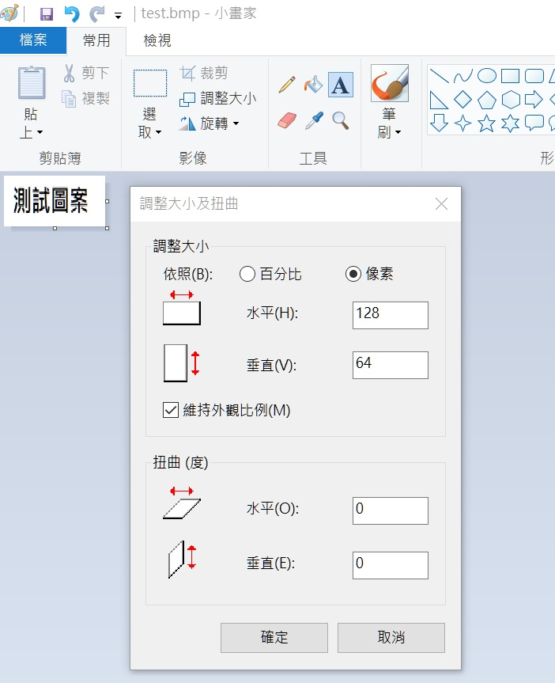

# Image2cpp (Add LSB first function by Mason)

原先 tool 不支援 LSB first 功能，造成使用 SSD1306 顯示時會有問題

- 勾選 Invert image colors，讓顯示為黑底白字
- Draw mode:	
選擇第一個  Horizontal_LSB - 1 bit per pixel

- 產生的 code 就可以讓 ESP32CAM 來使用

